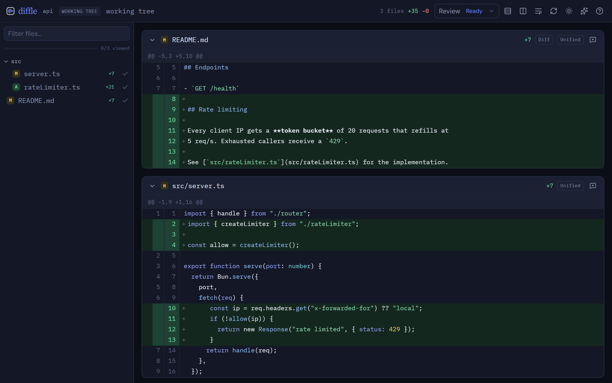
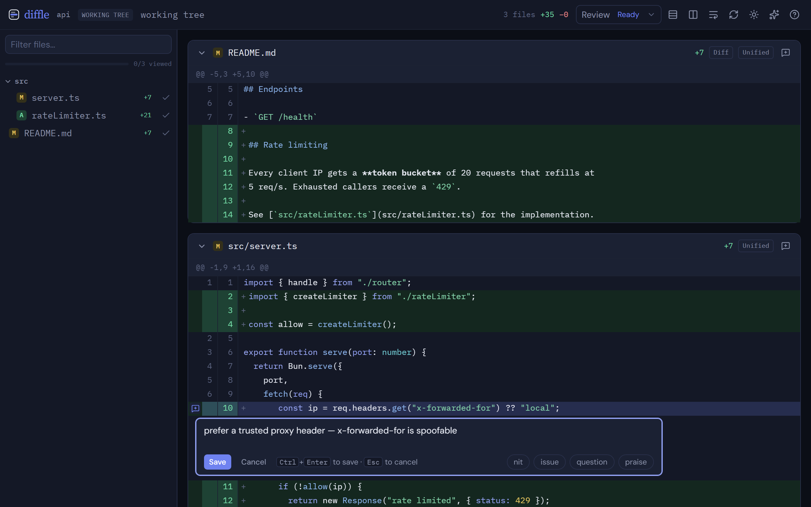
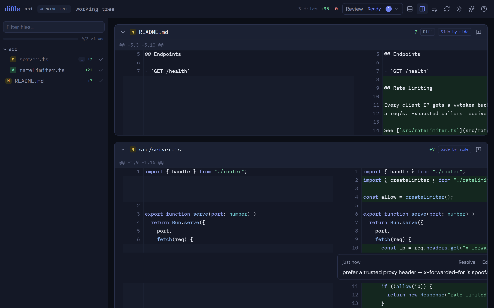
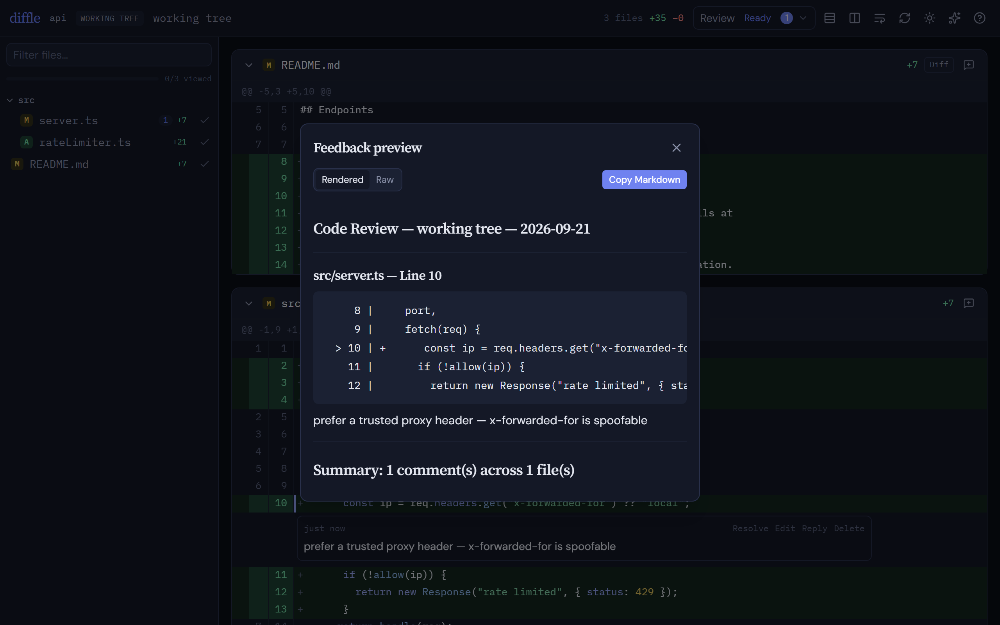

# diffle

Local git diff viewer for focused code review. Leave inline comments on any line, then return structured feedback to an agent or copy it manually.

**Site & docs: [diffle.dev](https://diffle.dev)**

## Demo


Review a diff, comment on exact lines, and export structured feedback for your agent. [Watch the MP4](docs/screenshots/walkthrough.mp4) or read the [docs](https://diffle.dev).

## Screenshots



| Inline comment | Side-by-side | Structured feedback |
| --- | --- | --- |
|  |  |  |

## Install

diffle ships as a single self-contained binary — no checkout, no Node, no sidecar files. It needs only **`git`** on your `PATH`.

```sh
# macOS / Linux
curl -fsSL https://diffle.dev/install | sh
```

```powershell
# Windows
irm https://diffle.dev/install.ps1 | iex
```

The installer downloads the binary for your OS/arch, verifies its SHA-256 against the published checksums, and installs it to `~/.diffle/bin`. Keep it current with `diffle update`. Full instructions — custom locations, uninstall, building from source — are in the [installation guide](https://diffle.dev/getting-started/installation/).

## Usage

```sh
diffle                  # working tree vs HEAD (untracked included)
diffle staged           # staged changes only
diffle <branch>         # current branch vs named branch (PR-style)
diffle <ref1>..<ref2>   # commit range
diffle browse           # review the whole codebase
diffle browse src/      # scope to a subtree
diffle mcp serve        # local MCP server for agent integrations
diffle sessions         # list running diffle sessions
diffle cleanup          # stop stale sessions and finished reviews
diffle update           # self-update to the latest release
```

Flags: `-p, --port <n>` fixed port, `--no-open` don't launch the browser, `--review-id <id>` reopen a record, `-v, --version`, `-h, --help`. `cleanup` accepts `--yes` to skip its confirmation and `--all` to also stop active sessions.

diffle reviews whichever git repo you run it from, then prints a `http://localhost:<port>` URL and opens it in your browser — the diff renders there, not in the terminal.

## Keyboard shortcuts

Press `?` in the UI for this list at any time.

| key | action |
| --- | --- |
| `j` / `k` | next / previous file |
| `v` | toggle viewed on the current file |
| `s` | unified ↔ side-by-side (added and deleted files stay unified) |
| `o` | single-file ↔ all-files view |
| `t` | toggle light / dark mode |
| `r` | re-run the diff |
| `c` | preview review feedback |
| `?` | show the shortcut overlay |
| `Esc` | close dialogs |

To comment on a range, drag across the line numbers or shift-click a second line.

## Review with an agent

1. Ask Codex or Claude Code: `Review my current changes with diffle.`
2. Leave line- or file-level comments in diffle and choose **Return Feedback**.
3. Return to the agent and say `continue`.
4. Agent replies and rereview requests appear in diffle as they happen; choose **Refresh diff** from the notice to load the new changes.
5. Verify the changes, reply in a thread or resolve it, then approve or return more feedback. Asking the agent for more after approval reopens the same review.

Install the agent integration first — see [Agent integrations](#agent-integrations).

## Review records

Reviews are stored outside the repository under `~/.diffle/reviews/<review-id>/review.json`. Each
record keeps its Git comparison, comments, replies, addressed/resolved state, summary, and outcome.
Approved and cancelled reviews remain local until explicitly deleted.

**Resolve** a comment to keep it on the record but drop it from returned feedback and open-comment counts — reopen it any time.

When the code moves on and a comment's line or file leaves the current diff, it becomes **orphaned** — still saved, but no longer anchored anywhere in the view. **Preview Feedback** gathers these under **From earlier reviews**, where you can resolve or delete each one, and keeps them out of current feedback.

Markdown files open showing their diff; use the per-file **Preview** toggle to render them.

## Agent integrations

diffle ships explicit review skills for Codex and Claude Code that drive a review through the local MCP server. Both need the `diffle` command from [Install](#install) on your `PATH`.

```sh
# Claude Code
claude plugin marketplace add codywilliamson/diffle
claude plugin install loupe-review@loupe-local --scope user

# Codex
codex plugin marketplace add codywilliamson/diffle
codex plugin add loupe-review@loupe-local
```

Start a fresh agent session after installing (or run `/reload-plugins` in Claude Code), then ask
`Review my current changes with diffle.` The plugin is named `loupe-review` during the
compatibility window. Package sources and maintenance notes live in [`integrations/`](integrations/README.md); see the [agent feedback guide](https://diffle.dev/guides/agent-feedback/) for the full loop.

## Upgrading from loupe

diffle was previously **loupe**. The `loupe` command, `LOUPE_*` environment variables, and an
existing `~/.loupe` data directory keep working for one release — see
[Migrating from loupe](https://diffle.dev/guides/migrating-from-loupe/).

## Releases

See [CHANGELOG.md](CHANGELOG.md).
